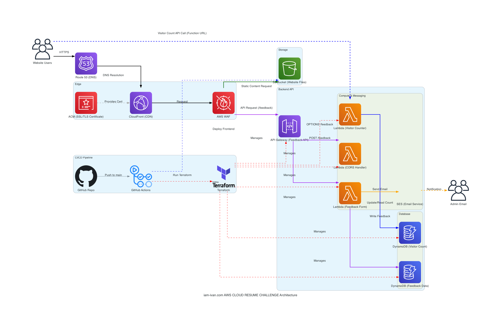

# AWS Cloud Resume Challenge: iam-ivan.com

 <!-- Replace with your actual domain -->

---

## Executive Summary

This project is my implementation of the [AWS Cloud Resume Challenge](https://cloudresumechallenge.dev/docs/the-challenge/), a hands-on initiative designed to help participants build and demonstrate fundamental cloud skills using Amazon Web Services. The core challenge involves deploying a static resume website served via CloudFront from S3, using Route 53 for DNS, implementing a visitor counter with Lambda and DynamoDB, and automating deployments with CI/CD pipelines.

Going beyond the standard requirements, this implementation significantly enhances the project's complexity and functionality by incorporating a **dynamic feedback submission form**. This addition required integrating several extra AWS services and building out further backend logic:

*   An **API Gateway** endpoint to receive form submissions.
*   An additional **Lambda function** (`CloudResume-ProcessFeedbackForm`) to process the submitted data.
*   A second **DynamoDB table** (`CloudResume-Feedback`) to securely store the feedback entries.
*   Integration with **Amazon Simple Email Service (SES)** to send real-time email notifications upon successful form submission.

This extension demonstrates a deeper application of serverless principles, API design, database management, and service integration within the AWS ecosystem. The entire infrastructure is defined using Terraform (Infrastructure as Code) and deployed automatically via GitHub Actions CI/CD pipelines.

**Live Site:** [https://iam-ivan.com/](https://iam-ivan.com/) 

---

## Table of Contents

*   [Project Goals](#project-goals)
*   [Key Features](#key-features)
*   [Technical Architecture](#technical-architecture)
    *   [Architecture Diagram](#architecture-diagram)
    *   [Core Components Breakdown](#core-components-breakdown)
*   [Technology Stack](#technology-stack)
*   [Infrastructure as Code (IaC) with Terraform](#infrastructure-as-code-iac-with-terraform)
*   [CI/CD Pipelines (GitHub Actions)](#cicd-pipelines-github-actions)
*   [Security Implementation](#security-implementation)
*   [Performance & Availability](#performance--availability)
*   [Cost Optimization](#cost-optimization)
*   [Deployment Process](#deployment-process)
*   [Future Enhancements](#future-enhancements)
*   [Contact](#contact)

---

## Project Goals

*   **Learn Core AWS Services:** Gain hands-on experience with fundamental AWS services for compute, storage, networking, database, and deployment.
*   **Implement Serverless Architecture:** Build dynamic functionality (visitor counter, feedback form) using serverless components like Lambda, API Gateway, and DynamoDB.
*   **Infrastructure Automation (IaC):** Define and manage the entire AWS infrastructure using Terraform for repeatability, version control, and automated provisioning.
*   **CI/CD Automation:** Implement automated testing and deployment pipelines using GitHub Actions for both frontend and backend/infrastructure changes.
*   **Extend the Challenge:** Enhance the base project requirements by adding a functional feedback form with backend processing and email notifications.
*   **Demonstrate Cloud Skills:** Create a practical portfolio piece showcasing skills relevant to Cloud Engineering and DevOps roles.

---

## Key Features

*   **Static Resume Website:** Displays resume content hosted on S3 and delivered globally via CloudFront.
*   **Dynamic Visitor Counter:** JavaScript on the frontend calls a Lambda Function URL to retrieve and increment a visitor count stored in DynamoDB.
*   **Feedback Submission Form:** Allows users to submit feedback via an HTML form.
*   **Backend Feedback Processing:** An API Gateway endpoint triggers a Lambda function to validate feedback, store it in DynamoDB, and send an email notification via SES.
*   **Custom Domain & HTTPS:** Website accessible via a custom domain (`iam-ivan.com`) with secure HTTPS connections enforced by CloudFront and ACM.
*   **Automated Deployments:** Fully automated CI/CD pipelines deploy frontend updates and backend/infrastructure changes upon pushes to the `main` branch.
*   **Infrastructure as Code:** Entire AWS environment managed via Terraform.

---

## Technical Architecture

The architecture leverages serverless and managed AWS services to create a scalable, resilient, secure, and cost-effective solution.

### Architecture Diagram

*(Diagram generated via `python documentation/iam-ivan_aws_architecture.py`)*

### Core Components Breakdown

1.  **DNS & Certificate (Route 53 & ACM):** User requests for `iam-ivan.com` hit Route 53, which resolves to the CloudFront distribution. AWS Certificate Manager (ACM) provides the free public SSL/TLS certificate used by CloudFront to enable secure HTTPS connections.
2.  **CDN & Edge Security (CloudFront & WAF):** CloudFront serves static website content (HTML, CSS, JS, images) from edge locations globally, reducing latency. It enforces HTTPS using the ACM certificate. AWS WAF is associated with CloudFront to protect against common web exploits (e.g., SQL injection, XSS) at the edge.
3.  **Static Content Storage (S3):** An S3 bucket stores the website's static files. Access to the bucket is restricted to CloudFront only, using Origin Access Control (OAC) for enhanced security (preventing direct S3 URL access).
4.  **Visitor Counter (Lambda Function URL & DynamoDB):**
    *   Client-side JavaScript makes a direct HTTPS request to a Lambda Function URL.
    *   The `CloudResume-visit-api` Lambda function (Python) is invoked.
    *   Lambda interacts with the `CloudResume-Visit` DynamoDB table (using an IAM Role for permissions) to atomically increment and retrieve the visitor count.
    *   The count is returned to the browser JavaScript for display.
5.  **Feedback Form API (API Gateway):**
    *   An HTTP API Gateway provides a regional endpoint (`/submit-form`) for the feedback form.
    *   It handles CORS (Cross-Origin Resource Sharing) preflight requests (OPTIONS), potentially via the integrated CORS configuration or the dedicated `CloudResume-CorsHandler` Lambda.
    *   It routes POST requests to the feedback processing Lambda.
6.  **Feedback Processing (Lambda, DynamoDB & SES):**
    *   The `CloudResume-ProcessFeedbackForm` Lambda function (Python) is triggered by POST requests to API Gateway.
    *   It validates the incoming form data.
    *   It writes the validated feedback entry to the `CloudResume-Feedback` DynamoDB table (using an IAM Role).
    *   It uses Amazon Simple Email Service (SES) to send an email notification about the new submission (using an IAM Role).
7.  **Database (DynamoDB):** Two DynamoDB tables configured with on-demand capacity provide scalable and cost-effective NoSQL storage for the visitor count and feedback submissions.
8.  **Deployment Automation (GitHub Actions & Terraform):**
    *   Code changes pushed to the GitHub repository trigger GitHub Actions workflows.
    *   One workflow handles frontend deployment (syncing files to S3, invalidating CloudFront).
    *   Another workflow handles backend/infrastructure deployment (linting, testing placeholders, packaging Lambdas, running `terraform apply` to manage all AWS resources).

---

## Technology Stack

*   **Cloud Provider:** Amazon Web Services (AWS)
*   **Infrastructure as Code:** Terraform (v1.3+)
*   **CI/CD:** GitHub Actions
*   **Backend Language:** Python (v3.10+)
*   **Frontend:** HTML5, CSS3, JavaScript
*   **DNS:** AWS Route 53
*   **CDN:** AWS CloudFront
*   **SSL/TLS Certificates:** AWS Certificate Manager (ACM)
*   **Web Application Firewall:** AWS WAFv2
*   **Storage:** AWS S3 (Simple Storage Service)
*   **Compute:** AWS Lambda
*   **API:** AWS API Gateway (HTTP API)
*   **Database:** AWS DynamoDB
*   **Email:** AWS Simple Email Service (SES)
*   **Security & Identity:** AWS IAM (Identity and Access Management)
*   **Diagramming:** Python `diagrams` library

---

## Infrastructure as Code (IaC) with Terraform

Terraform is used to define and manage the entire AWS infrastructure declaratively.

*   **Declarative Configuration:** Defines the desired state of the infrastructure in `.tf` files.
*   **State Management:** `terraform.tfstate` (managed via S3 backend with DynamoDB locking) tracks provisioned resources.
*   **Modularity:** Configuration is organized into logical files (`main.tf`, `variables.tf`, `outputs.tf`).
*   **Version Control:** Infrastructure changes are tracked in Git alongside application code.
*   **Repeatability:** Ensures consistent environment creation and updates.

---

## CI/CD Pipelines (GitHub Actions)

This project utilizes GitHub Actions for Continuous Integration and Continuous Deployment (CI/CD), automating the testing, packaging, and deployment processes.

### 1. Frontend Pipeline (`.github/workflows/front-end-cicd.yml`)

*   **Trigger:** Runs on every push to the `main` branch.
*   **Purpose:** Deploys the static website content.
*   **Steps:**
    *   Checks out the code.
    *   Configures AWS credentials.
    *   Prepares a deployment package containing only necessary frontend assets (`index.html`, `images/`, etc.).
    *   Syncs the deployment package to the S3 website bucket (`aws s3 sync --delete`).
    *   Creates a CloudFront invalidation (`/*`) to ensure users see the latest changes quickly.

### 2. Backend & Infrastructure Pipeline (`.github/workflows/backend-infra-cicd.yml`)

*   **Trigger:** Runs on pushes to the `main` branch *only if* changes are detected in the `backend/`, `terraform/` directories, or the workflow file itself.
*   **Purpose:** Manages the deployment of backend Lambda functions and the underlying AWS infrastructure using Terraform.
*   **Steps:**
    *   Checks out the code.
    *   Sets up Python and Terraform environments.
    *   Configures AWS credentials (currently using secrets, OIDC recommended).
    *   Lints Python code (`flake8`) and checks Terraform formatting (`terraform fmt -check`).
    *   Installs test dependencies (`pytest`) and runs unit tests (skips gracefully if no tests found in `tests/`).
    *   Packages each Lambda function into a ZIP file (stored temporarily in `terraform/lambda_zips/`).
    *   Initializes Terraform (`terraform init`).
    *   Validates Terraform configuration (`terraform validate`).
    *   Generates a Terraform execution plan (`terraform plan`).
    *   Applies the Terraform changes (`terraform apply -auto-approve`) to update AWS resources (Lambda functions, API Gateway, DynamoDB tables, etc.).

---

## Security Implementation

Security is implemented through various AWS services and configurations:

*   **HTTPS Enforcement:** CloudFront redirects HTTP requests to HTTPS and serves content using a valid SSL/TLS certificate managed by AWS Certificate Manager (ACM).
*   **Web Application Firewall (AWS WAF):** Associated with CloudFront to filter malicious traffic (e.g., SQL injection, cross-site scripting) based on AWS Managed Rules.
*   **Restricted S3 Access:** The S3 bucket hosting website files is configured with Origin Access Control (OAC), ensuring content can only be accessed through CloudFront, not directly via S3 URLs.
*   **IAM Least Privilege:** Lambda functions execute with IAM roles granting only the specific permissions needed to interact with other AWS services (e.g., DynamoDB Get/UpdateItem, SES SendEmail, CloudWatch Logs).
*   **API Gateway Authorization:** The visitor counter Lambda uses Function URL authorization set to `NONE` (public), while the feedback API Gateway could potentially implement authorization if needed (currently implicitly public).

---

## Performance & Availability

*   **CloudFront CDN:** Improves website load times by caching static assets at edge locations globally, closer to users. Also provides inherent high availability for static content delivery.
*   **Serverless Scalability:** AWS Lambda and DynamoDB automatically scale based on demand, ensuring the backend functions (visitor counter, feedback processing) can handle varying loads without manual intervention.
*   **Managed Services:** Leveraging managed services like DynamoDB, Lambda, API Gateway, and S3 reduces operational overhead and benefits from AWS's underlying high-availability infrastructure.

---

## Cost Optimization

*   **Serverless Pay-Per-Use:** Lambda functions are billed only for the compute time consumed during execution. DynamoDB On-Demand capacity bills only for actual reads and writes performed. This is highly cost-effective for applications with variable traffic.
*   **S3 Intelligent-Tiering (Optional):** Could be enabled on the S3 bucket to automatically move objects to lower-cost storage tiers if access patterns change (though likely minimal impact for small resume sites).
*   **CloudFront Efficiency:** Reduces data transfer costs from S3 by serving cached content from the edge. Free data transfer between CloudFront and S3 (using OAC). Free SSL certificate via ACM.

---

## Deployment Process

Deployments to the live environment are fully automated via the configured GitHub Actions CI/CD pipelines.

1.  Make changes to the frontend code (HTML, CSS, JS), backend Lambda code (Python), or infrastructure definition (Terraform).
2.  Commit the changes to your local Git repository.
3.  Push the commit(s) to the `main` branch on GitHub: `git push origin main`.
4.  GitHub Actions automatically detects the push and triggers the appropriate workflow(s) based on the files changed:
    *   Frontend changes trigger the `front-end-cicd.yml` workflow.
    *   Backend or Terraform changes trigger the `backend-infra-cicd.yml` workflow.
5.  The workflow executes, performing linting, testing (if available), packaging, and deploying the changes to AWS (S3 sync or `terraform apply`).

Monitor the workflow progress in the "Actions" tab of your GitHub repository.

---

## Future Enhancements

*   Implement comprehensive unit tests for all Lambda functions in the `tests/` directory.
*   Migrate AWS authentication in GitHub Actions from access keys to OIDC for enhanced security.
*   Refine workflow triggers to run validation steps (lint, test, plan) on Pull Requests before merging to `main`.
*   Add frontend build steps (minification, bundling) if the site complexity increases.
*   Implement GitHub Environments with manual approvals for the `terraform apply` step for added safety.
*   Add more sophisticated monitoring and alerting using CloudWatch.

---

## Contact

*   **Author:** Ivan Rivera
*   **Portfolio:** [https://iam-ivan.com](https://iam-ivan.com) 
*   **Email:** [ivan.rivera.email@gmail.com](mailto:ivan.rivera.email@gmail.com) 

---
